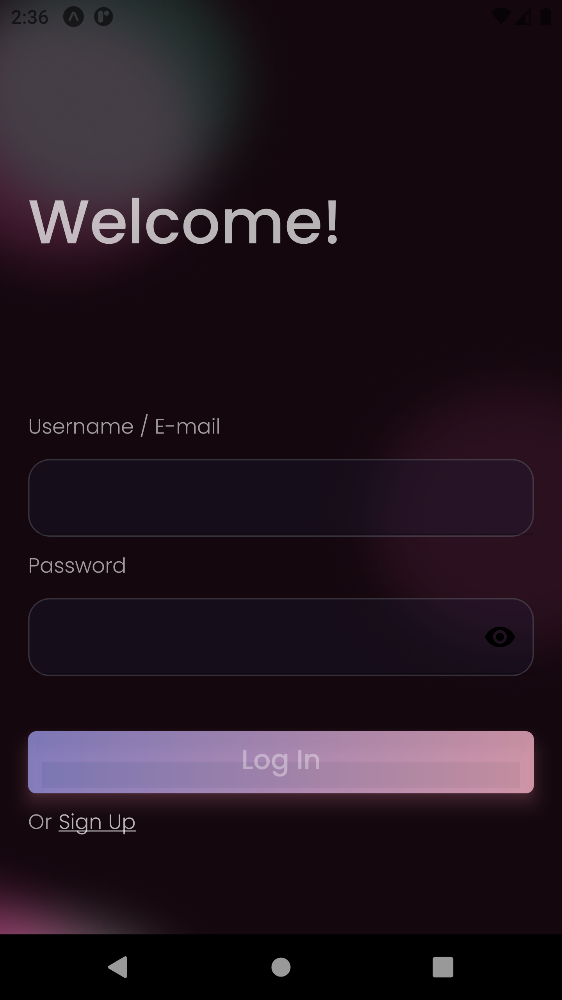

# Online Tuition App

---

## Description

To start using, run `expo start` on your terminal. You may run on an emulator or install Expo Go on your personal mobile device and scan the QR code.

On the Welcome page, you may try entering the below credentials and see the different media loads on the Dasbboard, depending if the user has subscription or not!

<br>Eg.
<br>Username/Email: `John Doe` or `banana@banana.com`
<br>Password: `banana`

```
Language Used: JavaScript

Core:
- React Native
- React.js
- API (Heroku Postgres)
```

## Preview


